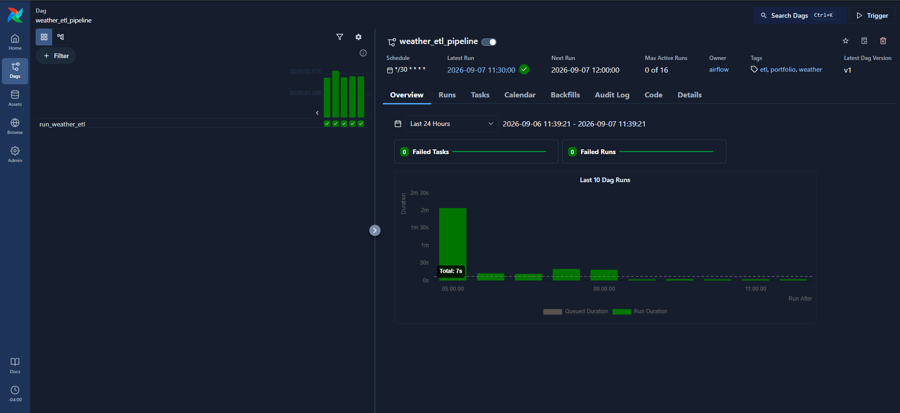
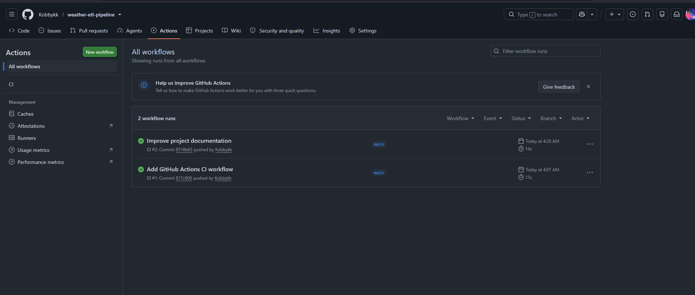

# Weather ETL Pipeline

An end-to-end data engineering pipeline that extracts current weather data from the Open-Meteo API, transforms and validates it with Python, and loads validated observations into PostgreSQL.

The project is containerized with Docker, orchestrated with Apache Airflow, tested with pytest, and continuously validated with GitHub Actions.

## Project Overview

The pipeline:
1. Extracts current weather data from the Open-Meteo API.
2. Transforms the API response into a structured record.
3. Validates data quality before loading.
4. Loads valid observations into PostgreSQL.
5. Uses idempotent loading to prevent duplicate observations.
6. Uses Apache Airflow to schedule runs every 30 minutes.
7. Uses pytest for automated extraction, validation, and loading tests.
8. Uses GitHub Actions for continuous integration.

## Architecture

```text
Open-Meteo API
      |
      v
   Extract
      |
      v
  Transform
      |
      v
  Validate
      |
      v
 PostgreSQL

Apache Airflow -> Scheduling / Orchestration
Docker Compose -> Multi-container runtime

Developer -> Git -> GitHub -> GitHub Actions -> pytest
```

## Pipeline in Action

### Airflow DAG Execution

The `weather_etl_pipeline` DAG is orchestrated by Apache Airflow and scheduled to run every 30 minutes.



### GitHub Actions CI

GitHub Actions automatically runs the pytest suite on pushes and pull requests targeting `main`.



## Technology Stack

| Technology | Purpose |
|---|---|
| Python | ETL development |
| PostgreSQL | Relational data storage |
| SQL | Schema definition and querying |
| Open-Meteo API | Weather data source |
| Apache Airflow | Scheduling and orchestration |
| Docker | Containerization |
| Docker Compose | Multi-container management |
| pytest | Automated testing |
| Git / GitHub | Version control and hosting |
| GitHub Actions | Continuous integration |

## ETL Workflow

### Extract
Retrieves current weather observations from Open-Meteo, including location, temperature, relative humidity, wind speed, weather code, and observation time.

### Transform
Converts the API response into a consistent record containing `city`, `latitude`, `longitude`, `temperature_f`, `humidity_percent`, `wind_speed_mph`, `weather_code`, `observation_time`, and `ingested_at`.

### Validate
Checks required fields and data-quality rules. Tests cover invalid humidity, negative wind speed, and missing required fields.

### Load
Loads validated observations into PostgreSQL. The loading process is idempotent so repeated processing of the same observation does not create duplicate records.

### Orchestrate
The Airflow DAG `weather_etl_pipeline` schedules the ETL workflow every 30 minutes and provides execution history and task status.

## PostgreSQL Data Model

Data is stored in `weather_observations`.

| Column | Type | Description |
|---|---|---|
| `id` | `BIGSERIAL` | Primary key |
| `city` | `VARCHAR(100)` | Observation city |
| `latitude` | `DOUBLE PRECISION` | Latitude |
| `longitude` | `DOUBLE PRECISION` | Longitude |
| `temperature_f` | `DOUBLE PRECISION` | Temperature in Fahrenheit |
| `humidity_percent` | `INTEGER` | Relative humidity |
| `wind_speed_mph` | `DOUBLE PRECISION` | Wind speed in mph |
| `weather_code` | `INTEGER` | Weather condition code |
| `observation_time` | `TIMESTAMPTZ` | Observation timestamp |
| `ingested_at` | `TIMESTAMPTZ` | Ingestion timestamp |

The PostgreSQL container automatically initializes the schema from `sql/create_tables.sql`.

## Automated Testing

The pytest suite covers:
- Successful and failed API extraction
- Successful and failed database loading
- Valid weather observations
- Invalid humidity
- Negative wind speed
- Missing required fields

Run:

```bash
python -m pytest -v
```

The current suite contains 8 tests. `pytest.ini` limits discovery to `tests/`.

## Continuous Integration

`.github/workflows/ci.yml` runs on pushes and pull requests targeting `main`.

The workflow checks out the repository, sets up Python 3.13, installs `requirements.txt`, and runs pytest. A test failure causes the CI workflow to fail.

## Docker and Docker Compose

`Dockerfile` packages the ETL application. `Dockerfile.airflow` provides the Airflow runtime.

`compose.yaml` manages the ETL PostgreSQL database, ETL application, Airflow metadata database, Airflow scheduler, DAG processor, API server, and Airflow initialization.

The PostgreSQL service uses persistent storage, automatic schema initialization, and a health check.

## Project Structure

```text
weather-etl-pipeline/
|-- .github/
|   `-- workflows/
|       `-- ci.yml
|-- dags/
|   `-- weather_etl_dag.py
|-- sql/
|   `-- create_tables.sql
|-- src/
|   |-- extract.py
|   |-- transform.py
|   |-- validate.py
|   |-- load.py
|   `-- main.py
|-- tests/
|   |-- conftest.py
|   |-- test_extract.py
|   |-- test_load.py
|   `-- test_validate.py
|-- .dockerignore
|-- .gitignore
|-- Dockerfile
|-- Dockerfile.airflow
|-- compose.yaml
|-- pytest.ini
|-- requirements.txt
`-- README.md
```

## Running Locally

### Prerequisites
- Git
- Docker Desktop
- Docker Compose

### Clone

```bash
git clone https://github.com/Kobbykk/weather-etl-pipeline.git
cd weather-etl-pipeline
```

### Configure environment variables

Create the local `.env` file required by the ETL configuration. Do not commit credentials or `.env` to Git.

### Start PostgreSQL

```bash
docker compose up -d postgres
docker compose ps
```

### Run the ETL manually

```bash
docker compose run --rm etl
```

### Verify loaded data

```bash
docker compose exec postgres psql -U postgres -d data_engineering -c "SELECT id, city, temperature_f, humidity_percent, wind_speed_mph, observation_time FROM weather_observations ORDER BY id DESC LIMIT 5;"
```

### Start Airflow

```bash
docker compose up -d airflow-scheduler airflow-dag-processor airflow-api-server
```

Airflow is exposed locally on port `8080`.

### Verify and trigger the DAG

```bash
docker compose exec airflow-scheduler airflow dags list
docker compose exec airflow-scheduler airflow dags trigger weather_etl_pipeline
docker compose exec airflow-scheduler airflow dags list-runs weather_etl_pipeline
```

## Example SQL

```sql
SELECT
    id,
    city,
    temperature_f,
    humidity_percent,
    wind_speed_mph,
    observation_time
FROM weather_observations
ORDER BY observation_time DESC
LIMIT 10;
```

## Security

Generated and sensitive files are excluded from version control, including `.env`, `.venv/`, `airflow-config/`, `airflow-logs/`, `logs/`, and `data/`. Passwords and environment-specific secrets should never be committed.

## Engineering Practices Demonstrated

- ETL pipeline design
- REST API ingestion
- Data transformation and validation
- PostgreSQL and SQL
- Idempotent loading
- Logging and error handling
- Unit testing and mocking
- Shared pytest fixtures
- Docker and Docker Compose
- Container health checks
- Automatic database initialization
- Apache Airflow orchestration
- Scheduled workflows
- Git/GitHub workflow
- GitHub Actions continuous integration

## Current Status

**Core pipeline complete and operational.**

Completed milestones include extraction, transformation, validation, PostgreSQL loading, idempotency, logging, automated tests, Docker containerization, Docker Compose, schema initialization, health checks, Airflow orchestration, successful scheduled/manual DAG execution, GitHub publishing, and passing GitHub Actions CI.

## Future Improvements

- Multiple-city ingestion
- Historical weather ingestion
- Richer data-quality metrics
- Failure notifications and monitoring
- Analytics transformations and dashboards
- Cloud deployment
- Infrastructure as code
- Container-based integration tests

## Portfolio Summary

This project demonstrates an end-to-end data engineering workflow rather than only an extraction script. It combines ingestion, transformation, validation, relational storage, testing, containerization, workflow orchestration, and continuous integration in a reproducible project.
